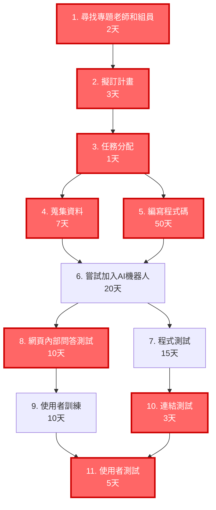
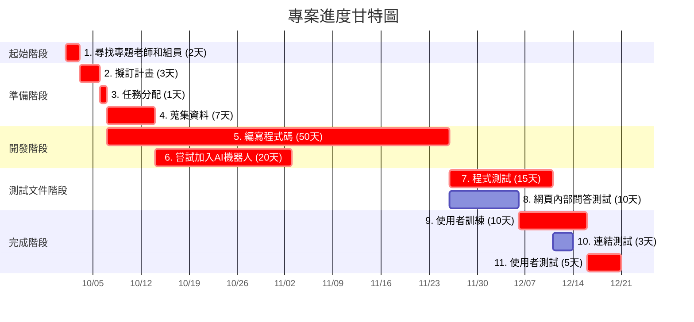

|工作|負責人|
|---|---|
| 程式架構 | 陳韋如 | 
| 程式測試 | 王思淇 | 
| 查找資料 | 林裕瑋 |
---

## 1.PERT / CPM 圖

```mermaid
graph TD
    A[1. 尋找專題老師和組員<br/>2天] --> B[2. 擬訂計畫<br/>3天]
    B --> C[3. 任務分配<br/>1天]
    C --> D[4. 蒐集資料<br/>7天]
    C --> E[5. 編寫程式碼<br/>50天]
    D --> G
    E --> G[6. 嘗試加入AI機器人<br/>20天]
    G --> H[7. 程式測試<br/>15天]
    G --> I[8. 網頁內部問答測試<br/>10天]
    I --> J[9. 使用者訓練<br/>10天]
    H --> K[10. 連結測試<br/>3天]
    J --> L[11. 使用者測試<br/>5天]
    K --> L
    
    class A,B,C,D,E,F,I,K,L critical
    classDef critical fill:#ff6666,stroke:#cc0000,stroke-width:3px,color:#ffffff;
    classDef normal fill:#f0f0f0,stroke:#333,stroke-width:2px,color:#000000;
```
## 2.甘特圖

```mermaid
gantt
    title 專案進度甘特圖
    dateFormat YYYY-MM-DD
    axisFormat %m/%d
    
    section 起始階段
    1. 尋找專題老師和組員 (2天)     :crit, m1, 2025-10-01, 2d
    
    section 準備階段
    2. 擬訂計畫 (3天)     :crit, m2, after m1, 3d
    3. 任務分配 (1天)    :crit, m3, after m2, 1d
    4. 蒐集資料 (7天)    :crit, m4, after m3, 7d

    section 開發階段
    5. 編寫程式碼 (50天)    :crit, m5, after m3, 50d
    6. 嘗試加入AI機器人 (20天)    :crit, m6, after m4, 20d
    
    section 測試文件階段
    7. 程式測試 (15天)    :crit,m7, after m5, 15d
    8. 網頁內部問答測試 (10天)  :m8, after m5, 10d
        
    section 完成階段
    9. 使用者訓練 (10天)    :crit, m9, after m8, 10d
    10. 連結測試 (3天)  :m10, after m7 m8, 3d
    11. 使用者測試 (5天)  :crit, m11, after m9 m10, 5d
```
