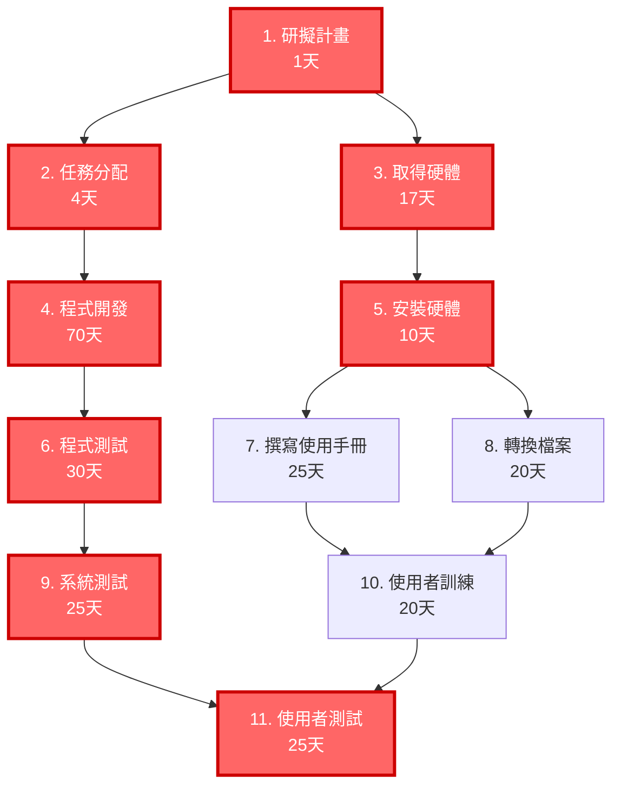
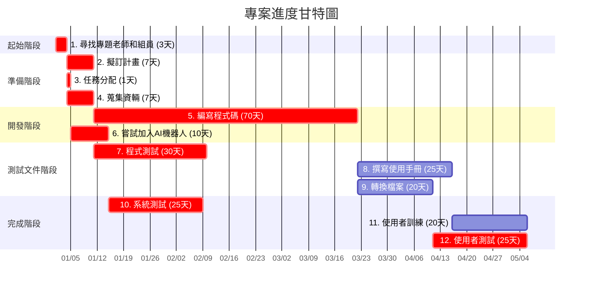
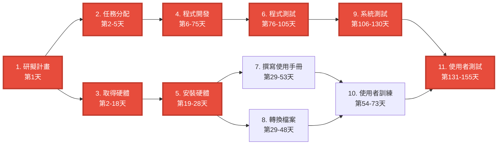

1. PERT / CPM 圖  
2. 甘特圖
3. 關鍵路徑  

---

## 1.PERT / CPM 圖

```mermaid
graph TD
    A[1. 研擬計畫<br/>1天] --> B[2. 任務分配<br/>4天]
    A --> C[3. 取得硬體<br/>17天]
    B --> D[4. 程式開發<br/>70天]
    C --> E[5. 安裝硬體<br/>10天]
    D --> F[6. 程式測試<br/>30天]
    E --> G[7. 撰寫使用手冊<br/>25天]
    E --> H[8. 轉換檔案<br/>20天]
    F --> I[9. 系統測試<br/>25天]
    G --> J[10. 使用者訓練<br/>20天]
    H --> J
    I --> K[11. 使用者測試<br/>25天]
    J --> K
    
    class A,B,C,D,E,F,I,K critical
    classDef critical fill:#ff6666,stroke:#cc0000,stroke-width:3px,color:#ffffff;
    classDef normal fill:#f0f0f0,stroke:#333,stroke-width:2px,color:#000000;
```
## 2.甘特圖

```mermaid
gantt
    title 專案進度甘特圖
    dateFormat YYYY-MM-DD
    axisFormat %m/%d
    
    section 起始階段
    1. 尋找專題老師和組員 (3天)     :crit, m1, 2025-01-01, 3d
    
    section 準備階段
    2. 擬訂計畫 (7天)     :crit, m2, after m1, 7d
    3. 任務分配 (1天)    :crit, m3, after m1, 1d
    4. 蒐集資輛 (7天)    :crit, m4, after m1, 7d

    section 開發階段
    5. 編寫程式碼 (70天)    :crit, m5, after m2, 70d
    6. 嘗試加入AI機器人 (10天)    :crit, m6, after m3, 10d
    
    section 測試文件階段
    7. 程式測試 (30天)    :crit, m7, after m4, 30d
    8. 撰寫使用手冊 (25天) :m8, after m5, 25d
    9. 轉換檔案 (20天)     :m9, after m5, 20d
    
    section 完成階段
    10. 系統測試 (25天)    :crit, m10, after m6, 25d
    11. 使用者訓練 (20天)  :m11, after m7 m8, 20d
    12. 使用者測試 (25天)  :crit, m12, after m9 m10, 25d
```
## 3.關鍵路徑

```mermaid
graph LR
    A[1. 研擬計畫<br/>第1天]:::critical --> B[2. 任務分配<br/>第2-5天]:::critical
    A --> C[3. 取得硬體<br/>第2-18天]:::critical
    B --> D[4. 程式開發<br/>第6-75天]:::critical
    C --> E[5. 安裝硬體<br/>第19-28天]:::critical
    D --> F[6. 程式測試<br/>第76-105天]:::critical
    E --> G[7. 撰寫使用手冊<br/>第29-53天]
    E --> H[8. 轉換檔案<br/>第29-48天]
    F --> I[9. 系統測試<br/>第106-130天]:::critical
    G --> J[10. 使用者訓練<br/>第54-73天]
    H --> J
    I --> K[11. 使用者測試<br/>第131-155天]:::critical
    J --> K
    
    classDef critical fill:#e74c3c,stroke:#c0392b,stroke-width:3px,color:#ffffff;
    classDef normal fill:#ecf0f1,stroke:#bdc3c7,stroke-width:2px,color:#2c3e50;
```
