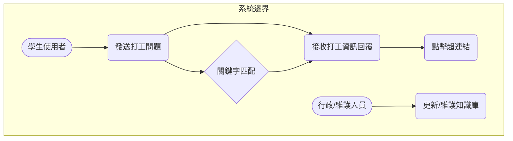

# 校內打工資訊－網頁問答機器人

##  第13組
**組長:** 陳韋如  
**組員:** 王思淇、林裕瑋  

---
## 功能性需求（Functional Requirements）
1.	基於打工資訊的回覆 機器人應能針對「申請流程」、「薪資標準」、「常見職缺」等校內打工相關問題，提供準確的文本回覆。
2.	關鍵字與意圖匹配	系統需具備基本的自然語言處理能力，能識別學生問題中的關鍵詞，並將其與知識庫中的標準問題進行匹配。
3.	超連結與附件提供	當回答涉及校內特定表單或外部公告時，機器人的回覆應能包含可點擊的超連結或提供文件下載。
4.	對話歷史紀錄顯示	系統介面應能持續顯示使用者和機器人的對話內容，確保學生能追溯先前的資訊。  

---

## 非功能性需求（Non-Functional Requirements）

1.  機器人提供的所有資訊（如薪資、截止日）必須與校方最新規定一致。	98% 的事實性問題回覆內容必須正確無誤
2.  機器人處理學生問題並給予回覆的延遲需控制在最低限度。	95% 的問題回應時間需在 1.5 秒內完成。
3.  聊天介面需支援響應式設計 (RWD)，確保在手機上也能輕鬆使用。	在主流手機瀏覽器上，介面無佈局崩潰或元素重疊。
4.  知識庫應提供易於操作的後台介面，方便行政人員定期更新打工資訊。	行政人員能在 10 分鐘內完成一條新公告的知識庫更新。  

---

## 功能分解圖（Functional Decomposition Diagram, FDD)
```

校內打工資訊 — 網頁問答機器人系統
├── 使用者前端介面
│   ├── 聊天視窗顯示 (RWD)
│   ├── 訊息輸入與發送
│   └── 歷史對話管理
├── 核心對話引擎
│   ├── 訊息接收與解析 (NLP)
│   ├── 知識匹配與檢索
│   └── 回覆內容生成 (含超連結處理)
└── 知識庫與數據管理
    ├── 打工資訊知識庫 (FAQ)
    ├── 關鍵字/意圖配置
    └── 知識庫定期更新

```

---

## 使用案例圖（Use Case Diagram）

---

## 使用案例說明（Use Case Descriptions）

### Use Case 1：發送打工問題 
- **主要參與者：** 學生使用者  
- **前置條件：** 網頁已載入，機器人系統正常運作  
- **主要流程：**  
  1. 學生在輸入框中鍵入問題（例如：「請問校內工讀時薪是多少？」）
  2. 學生點擊「發送」按鈕
  3. 系統將問題送至後端的核心對話引擎
  4. 系統在對話視窗中顯示學生發出的訊息。  

---

### Use Case 2：接收打工資訊回覆  
- **主要參與者：** 核心對話引擎  
- **前置條件：** 後端已成功收到學生發送的問題  
- **主要流程：**  
  1. 核心對話引擎接收到學生訊息
  2. 引擎執行 關鍵字匹配，從「打工資訊知識庫」中檢索答案
  3. 引擎找到匹配的答案（例如：工讀生時薪標準)
  4. 引擎將答案以文本格式回傳給前端
  5. 系統在對話視窗中顯示機器人的回覆，例如：「目前校內工讀生的基本時薪為 $X 元。」  

---

### Use Case 3：更新/維護知識庫 
- **主要參與者：** 行政/維護人員  
- **前置條件：** 行政人員已通過驗證登入後台管理介面  
- **主要流程：**  
  1. 行政人員獲知校內打工相關規定有所變動（例如：時薪調整）
  2. 人員進入「知識庫維護」後台介面
  3. 人員找到對應的知識條目（例如：時薪標準）
  4. 人員修改舊的答案內容，並可更新或新增相關的關鍵字
  5. 人員點擊「儲存並發布」按鈕
  6. 系統將變更即時應用到核心對話引擎的知識庫中。 

---


